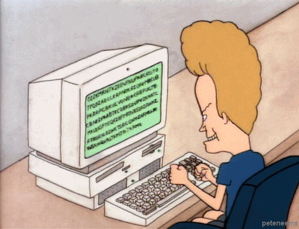

# Python Advanced Study

> Hi, everyone here👨🏻‍💻 Good to meet you.
I have studied Python's basic grammar so far.
From now on, I'm going to try to improve my understanding of Python through an advanced process📚

I am always learning with the goal of 1 Commit per day (one Commit per day is often referred to as 'TIL')
Just like when I learned Python's basic grammar, I will always focus on studying with fun and interest. 

Like everyone in the world,
To be a single developer...👨🏻‍💻

>>Through Python deep learning, we want to learn html and css after learning from "data-type deep" to "advanced function".

---

 
Let's Do it!

## Contents📍

### Deepening of data types
1. [String Handling](./md/01.String_Handling.md)